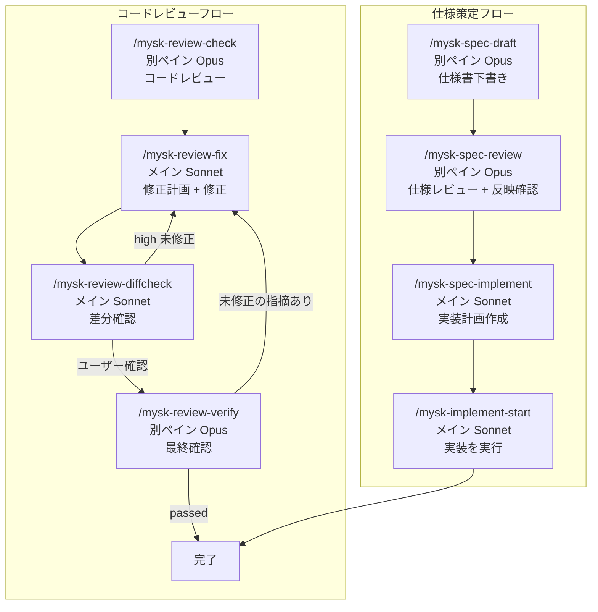
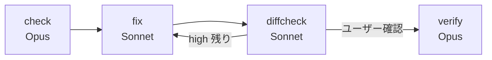
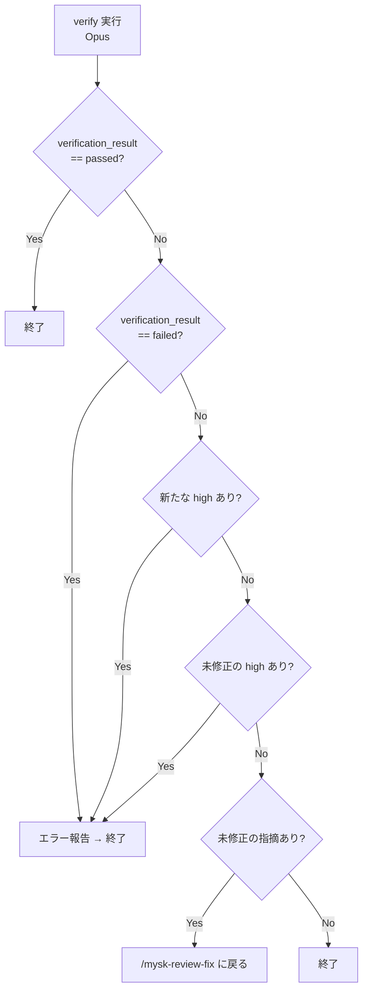

# mysk Workflow

仕様策定からコードレビューまでの一連のワークフローを管理するスキル群。

## 目次

1. [全体像](#全体像)
2. [ディレクトリ構造](#ディレクトリ構造)
3. [仕様策定フロー](#仕様策定フロー)
4. [コードレビューフロー](#コードレビューフロー)
5. [終了条件](#終了条件)
6. [コマンド早見表](#コマンド早見表)
7. [仕様書の必須セクション](#仕様書の必須セクション)
8. [レビューJSON形式](#レビューjson形式)

---

## 全体像



**フロー**: `draft → review → implement` の直線フロー。レビュー後に反映確認と差分更新まで実行される。

---

## ディレクトリ構造

```
~/.local/share/claude-mysk/
└── {timestamp}-{slug}/           # run_id (例: 20260327-101530Z-user-auth)
    ├── spec.md                   # 仕様書（確定版）
    ├── spec-draft.md             # 仕様書（下書き）
    ├── spec-review.json          # 仕様レビュー結果
    ├── impl-plan.md              # 実装計画
    ├── review.json               # コードレビュー結果
    ├── fix-plan.md               # 修正計画
    ├── diffcheck.json            # 差分確認結果
    ├── verify.json               # 最終検証結果
    ├── verify-rerun.json         # 再検証結果
    ├── run-meta.json             # run_id自動解決用メタデータ
    ├── status.json               # 進捗管理（汎用）
```

**run_idの形式**: `YYYYMMDD-HHMMSSZ-{slug}`

---

## 仕様策定フロー

### ステップ1: 仕様書下書き `/mysk-spec-draft [topic]`

別ペインでサブエージェントを起動し、仕様を策定する。

```
開始
  │
  ├─ 別cmuxペインを作成
  ├─ サブエージェント（Opus・medium effort）を起動
  ├─ ユーザーと対話しながら仕様を策定
  │   └─ AskUserQuestionで質問
  │
  ├─ 仕様書を下書き保存
  │   └─ spec-draft.md
  │
  └─ ユーザー確認
      ├─ はい → spec.md にコピー → /mysk-spec-review（仕様レビュー + 反映確認）
      ├─ いいえ → 破棄
      └─ 修正して → 直接編集
```

**完了後**: 次は `/mysk-spec-review`（仕様レビュー + 反映確認）

### ステップ2: 仕様レビュー `/mysk-spec-review [run_id]`

仕様書をレビューし、不備や改善点をJSONで保存する。

```
レビュー観点:
  - 完全性: 必要な情報が網羅されているか
  - 明確性: 曖昧な表現がないか
  - 一貫性: 記述間で矛盾がないか
  - 実現可能性: 技術的・時間的制約を考慮できるか
  - テスト可能性: 受け入れ条件が検証可能か
```

出力: `spec-review.json`

**完了後**: 次は `/mysk-spec-implement` で実装計画を作成

### ステップ3: 実装計画 `/mysk-spec-implement [run_id]`

仕様書を読み込み、実装計画を作成する。

```
実装計画内容:
  - 実装の概要
  - 必要なファイルと役割
  - 実装の順序（フェーズ分割）
  - 各フェーズの具体的なタスク
  - 受け入れ条件との対応付け

出力形式: impl-plan.md（確度付き）

「確度付き」とは:
- 各タスクのファイルパス・変更箇所に「確定」「候補」「調査必要」の確度を付与する
- spec.md だけで確定できない情報は「候補」や「調査必要」として出力し、実装時に repo 探索で補完することを前提とする
- impl-plan.md をさらに厳密化するのではなく、/mysk-implement-start 側で探索・補完できるようにする
```

**完了後**: 次は `/mysk-implement-start` で実装を開始

**補足**: 計画が粗くても実装開始時に探索・補完する。`/mysk-implement-start` はプリフライトで repo 探索を行い、タスクを実行可能な粒度に再分解してから実装する。

---

## コードレビューフロー

### ステップ1: コードレビュー `/mysk-review-check [run_id] [path]`

別ペイン（Opus/max）でサブエージェントを起動し、コードをレビューする。

```
レビュー対象:
  - パス指定あり: 指定されたファイル/ディレクトリ
  - パス指定なし: 現在のGit diff

レビュー観点:
  - 優先順位: 正確性、回帰、セキュリティ、欠けているテスト
  - 重要度: high / medium / low
```

出力: `review.json`

**完了後**: 次は `/mysk-review-fix` で指摘を修正

### ステップ2: 修正 `/mysk-review-fix [run_id]`

レビューJSONを読み、修正計画を提示→確認→修正を実施する。

```
修正対象:
  - 全指摘（高重要度・中重要度・低重要度）

確認後:
  - 全指摘を修正
  - 変更内容と検証結果を報告
```

出力: `fix-plan.md`

**完了後**: 次は `/mysk-review-diffcheck` で修正状況を確認

### ステップ3: 差分確認 `/mysk-review-diffcheck [run_id]`

メインセッション（Sonnet）で修正状況を軽量確認する。別ペイン不要。

```
確認内容:
  - review.json の各指摘が修正されているか
  - verify.json（またはverify-rerun.json）の new_findings も確認（存在する場合）

判定:
  - high/medium/low 未修正あり → /mysk-review-fix に戻る
  - 全て fixed → verifyに進む
```

**重要**: verifyへの遷移にはユーザー確認が必要です。diffcheck結果を確認し、ユーザーの指示を待ってください。

**判定結果の要約**: high未修正→fixへ戻る、ユーザー確認→verifyへ

出力: `diffcheck.json`

### ステップ4: 最終確認 `/mysk-review-verify [run_id]`

別ペイン（Opus/max）でフルレビューを行い、修正サイクルを完了させる。

```
検証観点:
  - 修正確認: 指摘された問題が解決されているか
  - 回帰確認: 新たな問題が発生していないか
  - 副作用確認: 関連コードに影響がないか
```

出力: `verify.json`（再実行時は `verify-rerun.json`）

### fix-diffcheck ループ

ステップ2〜3を繰り返す。中間確認はメインセッション（Sonnet）で軽量実行するため、Opus のトークン消費を抑えられる。



---

## 終了条件

### review-fix → review-diffcheck ループ

```
fix 実行
       ↓
diffcheck 実行
       ↓
  high 未修正あり？
  ├─ Yes → /mysk-review-fix（ループ継続）
  └─ No → 続行
       ↓
  ユーザー確認 → /mysk-review-verify（最終確認）
```

### review-verify（最終確認）

verify は初回で verify.json に保存。再実行時は verify-rerun.json に保存（ユーザー確認が必要）。
後続コマンドは verify-rerun.json を優先して読み込む（存在しない場合は verify.json）。



### 終了条件まとめ

| 条件 | アクション |
|------|----------|
| diffcheck: ユーザー確認あり | `/mysk-review-verify` へ |
| diffcheck: high 未修正あり | `/mysk-review-fix` ループ継続 |
| verify: passed | **終了** |
| verify: failed（検証エラー） | エラー報告 → **終了** |
| verify: 新たな high 発生 | エラー報告 → **終了** |
| verify: 未修正の high あり | エラー報告 → **終了** |
| verify: 未修正の指摘あり | /mysk-review-fix に戻る |
| verify: high なし、未解決なし | **終了** |

---

## コマンド早見表

| コマンド | 説明 | 実行場所 | 引数 |
|---------|------|---------|------|
| `/mysk-spec-draft` | 仕様書下書き作成 | 別ペイン(Opus) | `[topic]` |
| `/mysk-spec-review` | 仕様レビュー＋反映確認 | 別ペイン(Opus) | `[run_id]` |
| `/mysk-spec-implement` | 実装計画作成（計画のみ） | メイン | `[run_id]` |
| `/mysk-implement-start` | impl-plan.mdを読み込み実装を実行 | メイン | `[run_id]` |
| `/mysk-review-check` | コードレビュー | 別ペイン(Opus) | `[run_id] [path]` |
| `/mysk-review-fix` | 修正計画と修正 | メイン | `[run_id]` |
| `/mysk-review-diffcheck` | 差分確認（軽量） | メイン | `[run_id]` |
| `/mysk-review-verify` | 最終確認 | 別ペイン(Opus) | `[run_id]` |

**引数省略時**: 最新の run_id を自動選択（`/mysk-review-check` は除く。同コマンドは新規 run_id を生成する）

---

## 仕様書の必須セクション

- 概要
- 目的
- 利用者
- ユースケース
- 入出力
- スコープ（範囲内と範囲外）
- 受け入れ条件

---

## レビューJSON形式

### review.json（コードレビュー）

```json
{
  "version": 1,
  "run_id": "20260327-101530Z-user-auth",
  "created_at": "UTCタイムスタンプ",
  "updated_at": "UTCタイムスタンプ",
  "status": "in_progress | waiting_for_user | completed | failed",
  "progress": "現在の進捗メッセージ",
  "project_root": "プロジェクトルートの絶対パス",
  "source": {
    "type": "diff or file",
    "value": "対象パス"
  },
  "summary": {
    "overall_risk": "high or medium or low",
    "headline": "高重要度 X 件、中重要度 Y 件",
    "finding_count": Z
  },
  "findings": [
    {
      "id": "F001",
      "severity": "high or medium or low",
      "file": "relative/path/to/file",
      "line": 42,
      "title": "簡潔なタイトル",
      "detail": "詳細な説明",
      "suggested_fix": "修正提案"
    }
  ]
}
```

**重要**: `project_root` フィールドは検証時にファイルパスを解決するために必須。

### spec-review.json（仕様レビュー）

```json
{
  "version": 1,
  "run_id": "20260327-101530Z-user-auth",
  "created_at": "UTCタイムスタンプ",
  "updated_at": "UTCタイムスタンプ",
  "status": "completed",
  "source": {
    "type": "spec",
    "value": "spec.md"
  },
  "summary": {
    "overall_quality": "評価",
    "headline": "サマリー",
    "finding_count": {"high": N, "medium": N, "low": N}
  },
  "findings": [
    {
      "id": "F1",
      "severity": "high or medium or low",
      "section": "完全性|明確性|一貫性|実現可能性|テスト可能性",
      "title": "タイトル",
      "detail": "詳細",
      "suggestion": "提案"
    }
  ]
}
```

### verify.json（最終検証）

```json
{
  "version": 1,
  "run_id": "20260327-101530Z-user-auth",
  "created_at": "UTCタイムスタンプ",
  "updated_at": "UTCタイムスタンプ",
  "status": "completed",
  "progress": "Verification completed",
  "source_review": "review.json",
  "project_root": "プロジェクトルートの絶対パス",
  "verification_result": "passed | failed",
  "summary": {
    "verified_count": 3,
    "fixed_count": 2,
    "remaining_count": 1,
    "new_issues_count": 0,
    "high_remaining": 0,
    "medium_remaining": 1,
    "low_remaining": 0
  },
  "verifications": [
    {
      "original_finding_id": "F001",
      "severity": "high or medium or low",
      "status": "fixed | not_fixed | unclear",
      "detail": "検証結果の詳細"
    }
  ],
  "new_findings": [
    {
      "id": "N001",
      "severity": "high or medium or low",
      "file": "relative/path/to/file",
      "line": 42,
      "title": "タイトル",
      "detail": "詳細",
      "related_fix": "関連する修正（例: F001）"
    }
  ]
}
```

**総合判定基準**:
- `passed`: すべての指摘がfixed。新たな問題も見つからない。
- `failed`: high/medium/low severityの未解決指摘が残っている、または新たな問題が見つかった場合、または検証エラー。

### diffcheck.json（差分確認）

```json
{
  "version": 1,
  "run_id": "20260327-101530Z-user-auth",
  "created_at": "UTCタイムスタンプ",
  "type": "diffcheck",
  "summary": {
    "total": 10,
    "findings": 10,
    "fixed": 8,
    "not_fixed": 1,
    "unclear": 1,
    "high_remaining": 1,
    "medium_remaining": 0
  },
  "checks": [
    {
      "finding_id": "F001",
      "severity": "high",
      "status": "fixed | not_fixed | unclear",
      "note": "備考"
    }
  ],
  "next_step": "verifyの実行にはユーザー確認が必要です。diffcheck結果を確認し、ユーザーの指示を待ってください。"
}
```

**判定基準**:
- `fixed`: 問題が完全に解消されており、同等の問題が同じ箇所で再発しない。根本原因が取り除かれていること。
- `not_fixed`: 問題が未解決、または修正が不十分で問題が残存している。
- `unclear`: 判断困難（実行結果や動作確認が必要、またはコード差分だけでは判断できない）

適用上の注記: diffcheckでは、コード差分に基づいて上記基準で判定する（実行結果は確認しない）。

### status.json（進捗管理）

サブエージェントが作業状態を保存するために使用。

```json
{
  "status": "in_progress | waiting_for_user | completed | failed",
  "progress": "現在の進捗メッセージ",
  "updated_at": "UTCタイムスタンプ"
}
```

---

*作成日: 2026-03-27*
*更新日: 2026-04-03*
