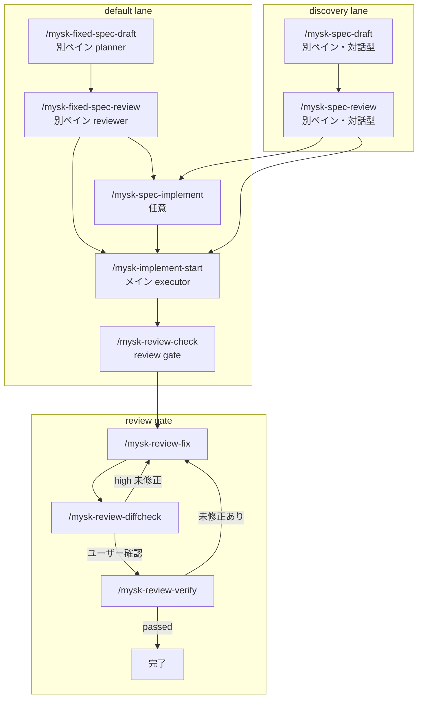

# mysk Workflow

仕様策定からコードレビューまでを管理するスキル群。現行 workflow は **default lane** と **discovery lane** の 2 本を持つ。

## 全体像



## 実装メモ

- 別ペイン実行コマンドはすべて `templates/mysk/cmux-launch-procedure.md` を共有し、cmux 上でサブペインを起動する
- サブペイン起動後は CronCreate で monitor prompt を登録し、`status.json` / `review.json` / `verify.json` を監視する
- run_id を省略したコマンドは、各 run ディレクトリの `run-meta.json` にある `project_root` と現在のプロジェクトを照合して最新 run を選ぶ
- review 系の後続コマンドは `review.json.project_root` を基準に finding の相対パスを解決する
- verify は `verify-rerun.json` が存在する場合そちらを最新の真実として扱う

詳細な責務分割と JSON 契約は [implementation-survey.md](implementation-survey.md) を参照。

## default lane: fixed-spec planner / executor / reviewer

日常運用の標準フロー。役割分担は次の通り。

- planner: brief を short / fixed な artifact に落とす
- executor: fixed-spec に従って repo を探索し実装する
- reviewer: patch をレビューし、high / medium を gate する

### 標準フロー

1. `/mysk-fixed-spec-draft [topic]`
2. `/mysk-fixed-spec-review [run_id]`
3. `/mysk-implement-start [run_id]`
4. `/mysk-review-check [run_id]`
5. 必要なら `/mysk-review-fix -> /mysk-review-diffcheck -> /mysk-review-verify`

### default lane の原則

- `fixed-spec.md` を first-class artifact とする
- `impl-plan.md` は **任意**
- fixed-spec がある場合、executor は質問を増やさず自己決定を優先する
- review はオプションではなく **quality gate**

### fixed-spec の必須セクション

- Goal
- In-scope
- Out-of-scope
- Constraints
- Acceptance Criteria
- Edge Cases / Failure Modes
- Allowed Paths / Non-goals
- Test Notes
- Assumptions

## discovery lane: interactive spec

要件収集や greenfield の論点整理が必要なときだけ使う。

### フロー

1. `/mysk-spec-draft [topic]`
2. `/mysk-spec-review [run_id]`
3. 必要なら `/mysk-spec-implement [run_id]`
4. `/mysk-implement-start [run_id]`

discovery lane は残すが、**default は fixed-spec lane** とする。

## run directory

```text
~/.local/share/claude-mysk/{run_id}/
├── fixed-spec-draft.md
├── fixed-spec.md
├── fixed-spec-review.json
├── spec-draft.md
├── spec.md
├── spec-review.json
├── impl-plan.md
├── review.json
├── fix-plan.md
├── diffcheck.json
├── verify.json
├── verify-rerun.json
├── timeout-grace.json
├── run-meta.json
└── status.json
```

`run_id` の形式: `YYYYMMDD-HHMMSSZ-{slug}`

`timeout-grace.json` は monitor が長時間実行に対する猶予時間を延長したときだけ作成される任意ファイル。

## コードレビューフロー

### ステップ1: コードレビュー `/mysk-review-check [run_id] [path]`

別ペインでレビューを行い、`review.json` を保存する。

レビュー観点:
- 正確性
- 回帰
- セキュリティ
- 欠けているテスト

### ステップ2: 修正 `/mysk-review-fix [run_id]`

`review.json` を読み、修正計画を提示して修正を実施する。

### ステップ3: 差分確認 `/mysk-review-diffcheck [run_id]`

メインセッションで修正状況を軽量確認する。

- high / medium が未修正なら `/mysk-review-fix` に戻る
- 解消済みなら verify に進む

### ステップ4: 最終確認 `/mysk-review-verify [run_id]`

別ペインでフルレビューを行い、修正サイクルを完了させる。

## 終了条件

| 条件 | アクション |
|------|------------|
| diffcheck: high 未修正あり | `/mysk-review-fix` に戻る |
| diffcheck: ユーザー確認あり | `/mysk-review-verify` へ |
| verify: passed | 完了 |

## コマンド早見表

### default lane

| コマンド | 説明 | 実行場所 | 引数 |
|---------|------|---------|------|
| `/mysk-fixed-spec-draft` | fixed-spec 下書き作成 | 別ペイン | `[topic]` |
| `/mysk-fixed-spec-review` | fixed-spec レビューと凍結 | 別ペイン | `[run_id]` |
| `/mysk-implement-start` | fixed-spec/spec を主入力に実装 | メイン | `[run_id]` |
| `/mysk-spec-implement` | 任意で実装計画を追加作成 | メイン | `[run_id]` |

### discovery lane

| コマンド | 説明 | 実行場所 | 引数 |
|---------|------|---------|------|
| `/mysk-spec-draft` | interactive spec 下書き作成 | 別ペイン | `[topic]` |
| `/mysk-spec-review` | interactive spec レビューと反映 | 別ペイン | `[run_id]` |

### review gate

| コマンド | 説明 | 実行場所 | 引数 |
|---------|------|---------|------|
| `/mysk-review-check` | 差分または指定パスをレビュー | 別ペイン | `[run_id] [path]` |
| `/mysk-review-fix` | レビュー指摘の修正計画と修正 | メイン | `[run_id]` |
| `/mysk-review-diffcheck` | 修正状況を軽量確認 | メイン | `[run_id]` |
| `/mysk-review-verify` | 最終確認で修正サイクル完了 | 別ペイン | `[run_id]` |
