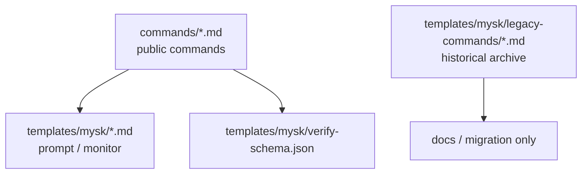

# mysk Workflow

現行の公開フローは、初心者向けに `仕様策定 -> 実装 -> レビュー` の 3 段階へ整理されています。公開コマンド定義は 5 個ですが、実運用フローとして覚える主役は `mysk-spec`、`mysk-implement`、`mysk-review`、補助として `mysk-reset` です。`mysk-help` はその案内役です。

## 公開フロー


## 公開コマンド

| コマンド | 目的 | 備考 |
|---------|------|------|
| `/mysk-spec` | 仕様策定の開始または再開 | Opus 主体。`spec.md` を確定させる |
| `/mysk-implement` | 実装 | `spec.md` を主入力に使う |
| `/mysk-review` | レビューの開始または再開 | Opus 主体。内部で修正ループを回す |
| `/mysk-help` | 使い方の確認 | 公開フローを要約する。表示内容は運用上の 4 コマンド中心 |
| `/mysk-reset` | monitor / サブペインの片付け | 異常終了時の回復用 |

## 再開ルール

### `/mysk-spec`

- 新規 topic を渡すと仕様策定を開始する
- run_id を渡すとその run の仕様策定を再開する
- spec 作成フェーズでは `spec.md` を直接更新し、完了時に monitor が `はい / いいえ / 修正して` で確認する
- `spec.md` が確定したら、同じ `/mysk-spec {run_id}` の再実行で spec review に進む
- `spec-review.json` の high / medium が残る場合は、monitor が `spec.md` への反映可否を確認する
- 反映時は `spec-vN.md` バックアップを作ってから `spec.md` を更新し、同じコマンドを再実行して再レビューする

### `/mysk-review`

- 初回は現在の作業ツリー差分を対象に review を開始する
- 2 回目以降は `review.json`、`diffcheck.json`、`verify.json`、`verify-rerun.json` を見て続きから再開する
- 修正フェーズの最初の応答ではコード変更を始めず、`fix-plan.md` を作って日本語で承認を取る
- final verify は `diffcheck.json` の remaining がすべて 0 になった後、ユーザー承認時だけ開始する
- verify で new high または未解決 high があればエラー扱いで停止し、medium / low だけが残る場合は `/mysk-review {run_id}` に戻す
- ユーザーは old command names を意識しない

## 内部実装

公開 command は top-level template を直接使います。legacy archive は移行や比較のために残しているだけです。



### 役割分担

- `commands/`
  - `/` 補完に出る公開コマンドだけ
- `templates/mysk/*.md`
  - cmux sub-pane に送る prompt と monitor
- `templates/mysk/legacy-commands/`
  - 旧コマンドの具体手順
  - runtime では参照しない
- `templates/mysk/verify-schema.json`
  - verify の source of truth

## 公開フローと内部ルーティング

### 仕様策定

`/mysk-spec` は run の状態に応じて次を切り替えます。

1. `spec.md` の新規作成
2. monitor による `spec.md` の確認
3. `spec-review.json` の作成
4. review 指摘を反映した `spec.md` の再レビュー

### 実装

`/mysk-implement` は次の優先順位で判断します。

1. ユーザーの明示指示
2. `spec.md`
3. repo 実態

### レビュー

`/mysk-review` は run の状態に応じて次を切り替えます。

1. 初回 review
2. `fix-plan.md` 作成とユーザー確認
3. 承認後の fix
4. diffcheck
5. 承認後の verify

ユーザー向けには常に `/mysk-review` とだけ見せます。

## run directory

```text
~/.local/share/claude-mysk/{run_id}/
├── run-meta.json
├── spec.md
├── spec-review.json
├── spec-vN.md
├── review.json
├── fix-plan.md
├── diffcheck.json
├── verify.json
├── verify-rerun.json
├── status.json
└── timeout-grace.json
```

### 補足

- `spec-draft.md`
- `fixed-spec-draft.md`
- `fixed-spec.md`
- `fixed-spec-review.json`
- `impl-plan.md`

これらは legacy run で残る可能性があります。現行の公開フローでは `spec.md`、`review.json`、`diffcheck.json`、`verify*.json` が primary artifact です。

## 運用上の注意

- `/mysk-spec` と `/mysk-review` には `cmux`、`tmux`、CronList / CronCreate / CronDelete が必要
- `/mysk-reset` は CronList / CronDelete を使い、workspace / surface が取れたときだけ cmux surface も閉じる
- 旧コマンドは archive 済みなので、利用者向けドキュメントや案内では slash command として列挙しない
- old run を扱うときも、ユーザーへの案内は新しい公開コマンド名へ統一する
