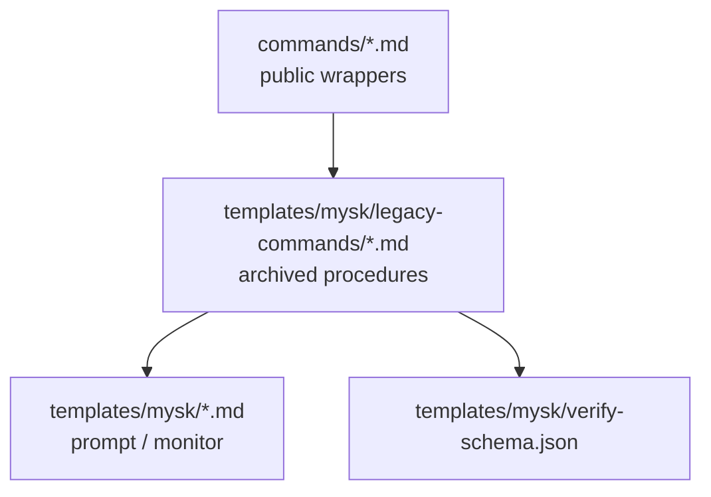

# mysk Workflow

現行の公開フローは、初心者向けに `仕様策定 -> 実装 -> レビュー` の 3 段階へ整理されています。ユーザーが覚える公開コマンドは `mysk-spec`、`mysk-implement`、`mysk-review`、補助として `mysk-help` と `mysk-reset` だけです。

## 公開フロー


## 公開コマンド

| コマンド | 目的 | 備考 |
|---------|------|------|
| `/mysk-spec` | 仕様策定の開始または再開 | Opus 主体。`spec.md` を確定させる |
| `/mysk-implement` | 実装 | `spec.md` を主入力に使う |
| `/mysk-review` | レビューの開始または再開 | Opus 主体。内部で修正ループを回す |
| `/mysk-help` | 使い方の確認 | 公開フローだけ表示 |
| `/mysk-reset` | monitor / サブペインの片付け | 異常終了時の回復用 |

## 再開ルール

### `/mysk-spec`

- 新規 topic を渡すと仕様策定を開始する
- run_id を渡すとその run の仕様策定を再開する
- `spec.md` ができた後でも、`spec-review.json` の結果次第では同じコマンドを再実行して詰め直す

### `/mysk-review`

- 初回は review 開始
- 以後は run 内の `review.json`、`diffcheck.json`、`verify.json`、`verify-rerun.json` を見て続きから再開
- ユーザーは old command names を意識しない

## 内部実装

公開面の簡素化のため、内部では legacy 手順を archive として残しています。



### 役割分担

- `commands/`
  - `/` 補完に出る公開コマンドだけ
- `templates/mysk/legacy-commands/`
  - 旧コマンドの具体手順
  - public wrapper からのみ参照される
- `templates/mysk/*.md`
  - cmux sub-pane に送る prompt と monitor
- `templates/mysk/verify-schema.json`
  - verify の source of truth

## 公開フローと内部ルーティング

### 仕様策定

`/mysk-spec` は run の状態に応じて次を切り替えます。

1. spec draft の開始
2. spec review の開始
3. review 結果を見た再開

### 実装

`/mysk-implement` は次の優先順位で判断します。

1. ユーザーの明示指示
2. `spec.md`
3. repo 実態
4. legacy 互換の `fixed-spec.md` / `impl-plan.md`

### レビュー

`/mysk-review` は run の状態に応じて次を切り替えます。

1. 初回 review
2. fix
3. diffcheck
4. verify

ユーザー向けには常に `/mysk-review` とだけ見せます。

## run directory

```text
~/.local/share/claude-mysk/{run_id}/
├── run-meta.json
├── spec-draft.md
├── spec.md
├── spec-review.json
├── review.json
├── fix-plan.md
├── diffcheck.json
├── verify.json
├── verify-rerun.json
├── status.json
└── timeout-grace.json
```

### 補足

- `fixed-spec-draft.md`
- `fixed-spec.md`
- `fixed-spec-review.json`
- `impl-plan.md`

これらは legacy 互換 run で残る可能性があります。現行の公開フローでは primary artifact ではありません。

## 運用上の注意

- `/mysk-spec` と `/mysk-review` には `cmux`、`tmux`、CronCreate / CronDelete が必要
- 旧コマンドは archive 済みなので、利用者向けドキュメントや案内では slash command として列挙しない
- old run を扱うときも、ユーザーへの案内は新しい公開コマンド名へ統一する
